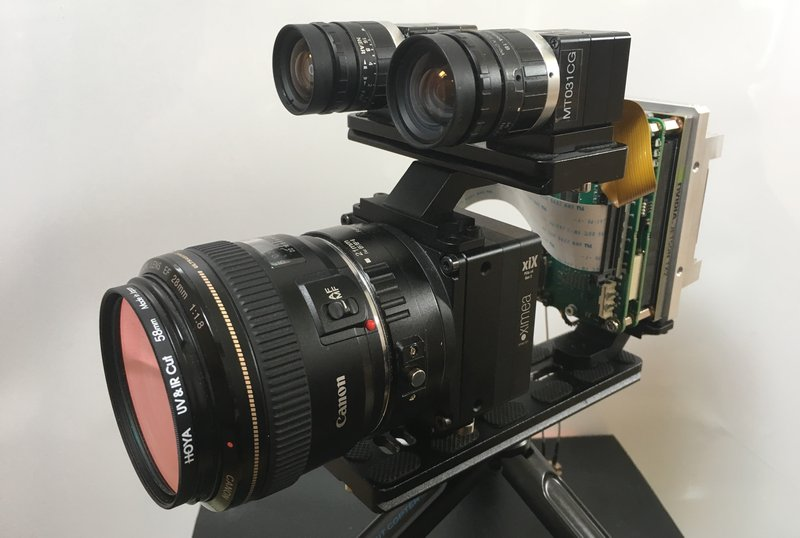
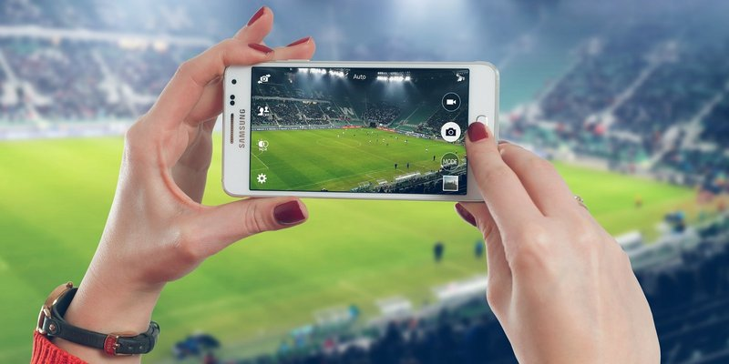
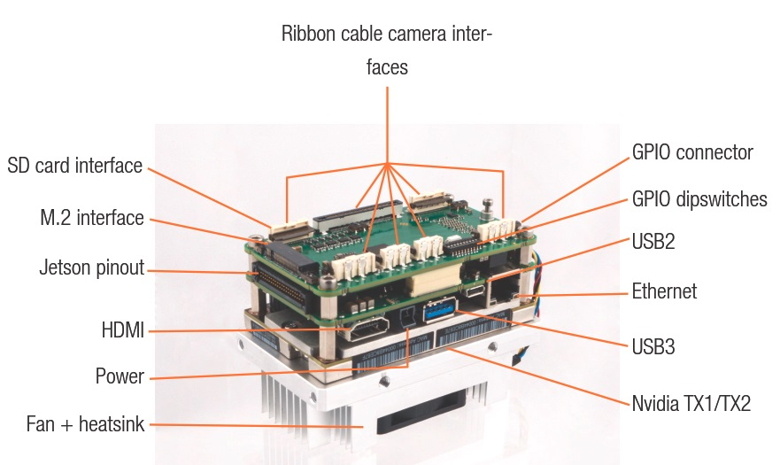

# Low latency H.264 streaming from Jetson TX2 to PC
#### Realtime remote control for any vision system is very important task which has a huge number of applications. People need to control remotely almost everything. To make it possible, we need to create a solution with minimum latency to ensure smooth video and instant feedback.

#### There are a lot of imaging systems which rely on small feedback time, like autonomous cars, hexacopters or drones, mobile robots that should be remotely controlled via wireless network, etc. Quite often these are multicamera systems, because just one camera can't be enough to get full info from controlling objects.

#### So the task gets more complicated and we will consider a vision system which is based on Jetson TX2 with several cameras, connected directly to Jetson. That scenario is widespread and it can offer remote control over wireless connection.
# Glass to Glass Video Latency Test for H264 RTSP Streaming
#### Low delay video streaming is a common task in many applications. Among these applications there are teleoperation scenarios such as controlling drones or telesurgery, virtual or augmented reality, autonomous control of dynamic processes using computer vision algorithms and neural networks which are applied to video in realtime. To evaluate the latency and the performance in such systems, it is important to be able to measure the glass-to-glass (G2G) delay for video acquisition and video transmission.

#### In general, standard glass to glass video latency test is important to evaluate real performance and latency of imaging system. This is actually the answer to the question about how fast it could be in real life in terms of latency. Glass-to-glass video latency, which is also called end-to-end (E2E) video delay, means the amount of time between the moment when the frame was captured and when it was displayed on the monitor. To be more precise, G2G is describing the time from when the photons of a visible event pass through the lens of the camera till the moment when that image is delivered to the glass of the monitor.

#### The G2G measurements are usually non-intrusive and they can be applied to a wide range of imaging systems. Furthermore, each video camera has a fixed frame rate, producing new images in constant time intervals. As we know, real world events are never synchronized to the camera frame rate and this is the way to make live realtime measurements, because real world events have to be triggered. That's why obtained G2G delay values are non-deterministic.

#### The idea of a simple glass-to-glass test is to show on the monitor two times: the current time and the capture time. This is how we can do that:

- Get the current time on PC and output it to the monitor
- Capture the image with displayed current time via camera
- Send captured frame from the camera to Jetson
- Image and Video processing on Jetson TX2
- Video encoding to H.264 via V4L2
- Video streaming from Jetson over wireless network
- Video acquisition on external PC
- Video decoding on NVIDIA GPU via NVDEC
- Video output to the monitor via OpenGL
- Compare the current time and the capture time
#### Finally, we will see at the same monitor two images: one with the current time and the other with the capture time. The difference between them is the latency of the imaging system.

#### Here there are several issues at that simple approach that can influence on the final result:

- OS and software timer latency on PC
- Refresh rate of the monitor
- Camera frame rate and exposure time
- OS latency at Jetson L4T
- Frame content and compression ratio
- B-frames in H.264 are turned off
#### G2G video latency could be evaluated this way, though for some cases such an accuracy could not be sufficient. In these cases more sofisticated hardware could be utilized, but here we consider the current approach to be viable. Due to the above restrictions, we expect to get pretty wide timing interval for video latency.
### All our tests will be based on NVIDIA Jetson TX2 System-on-Module
- 256 CUDA cores
- Dual Denver Quad ARM® A57 CPU
#### To connect a camera to Jetson TX2, we need a carrier board. Here you can see a carrier board for NVIDIA Jetson TX2 module, specially designed by XIMEA to connect their PCIe and USB3 cameras of xiX / xiC / xiQ series.

### xEC2 carrier board interfaces
- 4x PCIe X2G2 connectors for ribbon camera interfaces
- 1x PCIe X4G2 connectors for ribbon camera interfaces
- 2x USB3 connectors for ribbon camera interfaces
- GPIO connector and GPIO DIP switches
- Ethernet
- HDMI
- M.2 interface
- USB3 Type-A connector
- USB2 Micro-B connector
- Jetson pinout
- Power connector
- Fan power connector
- Wi-Fi antenna connectors are located on Jetson TX2 module

### Finally, up to eight XIMEA cameras can be connected to just one Jetson TX2
- 4x PCIe X2G2 cameras with ribbon camera interfaces
- 1x PCIe X4G2 camera with ribbon camera interfaces
- 2x USB 3.1 Gen1 cameras with ribbon camera interfaces
- 1x USB 3.1 Gen1 camera with standard USB Type A cable
#### The main idea is the following: one could create a multicamera system on Jetson by utilizing that XIMEA carrier board together with up to eight XIMEA cameras and software from MRTech. These are reliable solutions which have already been working in many imaging systems.

### Software package
- Linux for Tegra (L4T) operating system
- CUDA-10.0
- [Fastvideo SDK for Jetson](https://www.fastcompression.com/solutions/xavier-sdk.htm)
- XIMEA xiAPI with [CamTool demo application](https://www.ximea.com/support/wiki/allprod/XIMEA_CamTool)
- [MRTech](https://mr-technologies.com/) runtime application with implemented pipelines for all connected cameras
- Application to control aperture and exposure for each camera

### Receiving station
#### RTSP streams from all cameras can be received by using VLC application on one of the devices such as MacBook with Mac OS, desktop or laptop with Windows or Linux OS, Apple devices such as iPhone, iPad, etc.

### Full image processing pipeline on Jetson TX2 and Quadro P2000
- Image acquisition from both cameras and zero-copy to Jetson TX2
- Black level
- White Balance
- [HQLI Demosaicing](https://www.fastcompression.com/solutions/demosaicing.htm) (the simplest one to get better performancce)
- Export to YUV
- H.264 encoding via V4L2
- RTSP streaming from Jetson to the external PC via wireless network
- Video acquisition at external PC
- H.264 video decoding via NVDEC on desktop GPU for both video streams
- Show video streams at the same monitor via OpenGL
### Benchmarks for one and two-camera systems
#### These are benchmarks for two XIMEA MX031CG cameras and desktop receiving station with NVIDIA Quadro P2000 GPU over Wi-Fi

- Image sensor: Sony IMX252, 1/1.8", 2064×1544 resolution (3.2 MPix), 8-bit, global shutter, up to 218 fps
- Camera frame rate 70 fps; 14 ms between frames for each camera
- Exposure time: 1 ms
- PCIe data transfer: 4 ms
- Processing pipeline: 10 ms for one camera, 15 ms for two cameras
- Network: 1 ms average
- Display: 144 fps; 7 ms between frames
### Measured glass-to-glass video latency including NVIDIA TX2 H.264 streaming
- Full resolution, 1 camera: 35–66 ms, average/median 50 ms
- Full resolution, 2 cameras: 50–68 ms, average/median 60 ms
- 1080p/720p ROI: decrease of ~5 ms, which is not measurable in the test because it's less than accuracy
#### The above method for G2G evaluation gives us reasonable, though approximate values for the latency of that imaging system. That latency also depends on complexity of video processing pipeline, on image content and on encoding parameters. The above benchmarks for G2G include video processing and video transmission. If you need to compare these results with any other setup, please take that into account.

#### There are more sofisticated methods for latency measurements which are utilizing light-emitting diode (LED) as a light source and a phototransistor as a light detector. Such a setup for latency measurements includes the blinking LED in the field of view of the camera as signal generator, and tape a photoelectric sensor to where the LED is shown on the display. The LED triggers an oscilloscope which also records the signals from the photoelectric sensor. This allows to extract the G2G delay. The analysis of the data could be done automatically with a microcontroller board. That method could allow to get G2G delay with better precision.
